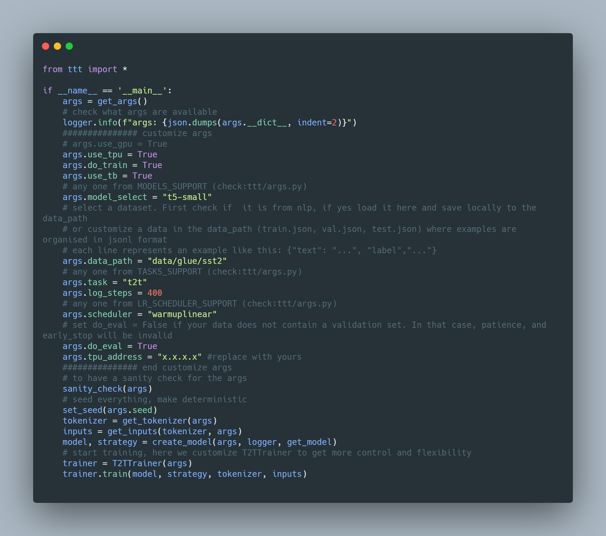

<p align="center">
    <br>
    
    <br>
<p>

<p align="center">
    <br>
    <a href="https://github.com/wangcongcong123/ttt/issues"></a>
    
    <a href="https://github.com/wangcongcong123/ttt"></a>
     
     <a href="https://pypi.org/project/pytriplet/"></a>
    <br>
<p>

## TTT: Fine-tuning Transformers with TPUs or GPUs acceleration, written in Tensorflow2.0+

**TTT** or (**Triple T**) is short for a package for fine-tuning 🤗 **T**ransformers with **T**PUs, written in **T**ensorflow2.0+. It is motivated to be completed due to bugs I found tricky to solve when using [the xla library](https://github.com/pytorch/xla) with PyTorch. As a newcomer to the TF world, I am humble to learn more from the community and hence it is open sourced here.

#### Next update:
- Coming soon: T5 pre-training on Chinese.

## Demo 
 [](https://colab.research.google.com/github/wangcongcong123/ttt/blob/master/ttt_notebook.ipynb)
 
The following demonstrates the example of fine-tuning T5-small for sst2 ([example_t5.py](example_t5.py)).


<!-- 
* This can be scaled to t5-large, t5-large, or even 3B if a 8-cores TPU is available. For GPUs, this fine-tuning is tested on T5-large in a server of 4 12-GB GTX-1080s even with per_device_train_batch_size=2, leading to a out-of-memory exception (OOM).
-->
## Features
- Switch between TPUs and GPUs easily.
- Stable training on TPUs.
- Customize datasets or load from [HF's datasets library](https://huggingface.co/nlp/viewer/?dataset=aeslc).
- Using pretrained tensorflow weights from the open-source library - [🤗 transformers](https://github.com/huggingface/transformers).
- Fine-tuning BERT-like transformers (DistilBert, ALBERT, Electra, RoBERTa) using keras High-level API.
- Fine-tuning T5-like transformers using customize training loop, written in tensorflow2.0.
- Supported tasks include single sequence-based classification task (both BERT-like models and T5 model), and translation, QA, or summarization (T5, as long as an example is characterized by: `{"source","....","target","...."}`

## Quickstart

#### Install
```
pip install pytriplet
```

or if you want to get the latest updates:

```shell
git clone https://github.com/wangcongcong123/ttt.git
cd ttt
pip install -e .
```

* make sure `transformers>=3.1.0`. If not, install via `pip install transformers -U`
#### update (2020-09-13): Example generation for T5 pretraining objective
```python
from ttt import iid_denoise_text
text="ttt is short for a package for fine-tuning 🤗 Transformers with TPUs, written in Tensorflow2.0"
# here the text is split by space to tokens, you can use huggingface's T5Tokenizer to tokenize as well.
original, source, target=iid_denoise_text(text.split(), span_length=3, corrupt_ratio=0.25)

# original: ['ttt', 'is', 'short', 'for', 'a', 'package', 'for', 'fine-tuning', '🤗', 'Transformers', 'with', 'TPUs,', 'written', 'in', 'Tensorflow2.0']
# source: ['ttt', '<extra_id_0>', 'a', 'package', 'for', 'fine-tuning', '🤗', 'Transformers', 'with', '<extra_id_1>', '<extra_id_2>']
# target: ['<extra_id_0>', 'is', 'short', 'for', '<extra_id_1>', 'TPUs,', 'written', 'in', 'Tensorflow2.0']
```

#### Update (2020-09-06): Example of fine-tuning T5 for translation ([example_trans_t5.py](example_trans_t5.py))

<a name="wmt_en_ro_t5"></a>
**Fine-tuning**: No boilerplate codes changed (the same as [example_t5](example_t5.py)) except for the following args:
```python3
# any one from MODELS_SUPPORT (check:ttt/args.py)
args.model_select = "t5-small"
# the path to the translation dataset, each line represents an example in jsonl format like: {"target": "...", "source","..."}
# it will download automatically for the frist time from: https://s3.amazonaws.com/datasets.huggingface.co/translation/wmt_en_ro.tar.gz
args.data_path = "data/wmt_en_ro"
# any one from TASKS_SUPPORT (check:ttt/args.py)
args.task = "translation"
args.max_src_length=128
args.max_tgt_length=128
args.source_field_name="source"
args.target_field_name="target"
args.eval_on="bleu" #this refers to sacrebleu as used in T5 paper
```

** On a TPUv3-8, the bleu score achieved by t5-base is 27.9 (very close to 28 as reported in [the T5 paper](https://arxiv.org/abs/1910.10683)), the fine-tuning args are [here](https://ucdcs-student.ucd.ie/~cwang/ttt/models/en2ro_t5_base/args.json) and training log is [here](https://ucdcs-student.ucd.ie/~cwang/ttt/models/en2ro_t5_base/train.log). 

#### Example of fine-tuning BERT for sst2 ([example_bert.py](example_bert.py))
```python3
from ttt import *

if __name__ == '__main__':
    args = get_args()
    # check what args are available
    logger.info(f"args: {json.dumps(args.__dict__, indent=2)}")
    ############### customize args
    # args.use_gpu = True
    args.use_tpu = True
    args.do_train = True
    args.use_tb = True
    # any one from MODELS_SUPPORT (check:ttt/args.py)
    args.model_select = "bert-base-uncased"
    # select a dataset following jsonl format, where text filed name is "text" and label field name is "label"
    args.data_path = "data/glue/sst2"
    # any one from TASKS_SUPPORT (check:ttt/args.py)
    args.task = "single-label-cls"
    args.log_steps = 400
    # any one from LR_SCHEDULER_SUPPORT (check:ttt/args.py)
    args.scheduler="warmuplinear"
    # set do_eval = False if your data does not contain a validation set. In that case, patience, and early_stop will be invalid
    args.do_eval = True
    args.tpu_address = "x.x.x.x" # replace with yours
    ############### end customize args
    # to have a sanity check for the args
    sanity_check(args)
    # seed everything, make deterministic
    set_seed(args.seed)
    tokenizer = get_tokenizer(args)
    inputs = get_inputs(tokenizer, args)
    model, _ = create_model(args, logger, get_model)
    # start training, here we keras high-level API
    training_history = model.fit(
        inputs["x_train"],
        inputs["y_train"],
        epochs=args.num_epochs_train,
        verbose=2,
        batch_size=args.per_device_train_batch_size*args.num_replicas_in_sync,
        callbacks=get_callbacks(args, inputs, logger, get_evaluator),
    )
```

So far the package has included the following supports for `args.model_select`, `args.task` and `args.scheduler` ([args.py](ttt/args.py)).

```python3
# these have been tested and work fine. more can be added to this list to test
MODELS_SUPPORT = ["distilbert-base-cased","bert-base-uncased", "bert-large-uncased", "google/electra-base-discriminator",
                  "google/electra-large-discriminator", "albert-base-v2", "roberta-base",
                  "t5-small","t5-base"]
# if using t5 models, the tasks has to be t2t* ones
TASKS_SUPPORT = ["single-label-cls", "t2t"]
# in the future, more schedulers will be added, such as warmupconstant, warmupcosine, etc.
LR_SCHEDULER_SUPPORT = ["warmuplinear", "warmupconstant", "constant"]
```

## Command lines (suited in GCP)

This has to be run in Google GCP VM instance since the tpu_address is internal IP from Google (or change `--use_tpu` to `use_gpu` if you have enough GPUs). The flag `--tpu_address` should be replaced with yours. Notice: these runs are run with a set of "look-good" hyper-parameters but not exhaustively selected.

#### Experiment BERT on sst2 using TPUv2-8

C-1-1:
```
python3 run.py --model_select bert-base-uncased --data_path data/glue/sst2 --task single-label-cls --per_device_train_batch_size 8 --num_epochs_train 6 --max_seq_length 128 --lr 5e-5 --schedule warmuplinear --do_train --do_eval --do_test --use_tpu --tpu_address x.x.x.x
```

C-1-2:

```
python3 run.py --model_select bert-large-uncased --data_path data/glue/sst2 --task single-label-cls --per_device_train_batch_size 8 --num_epochs_train 6 --max_seq_length 128 --lr 5e-5 --schedule warmuplinear --do_train --do_eval --do_test --use_tpu --tpu_address x.x.x.x
```

** In addition, experiments on larger batch sizes were also conducted on TPUv2-8. For example, when `per_device_train_batch_size` is 128 (batch size=8*128=1024), this first epoch takes around ~1 minute and the rest of each takes just ~15 seconds! That is fast but the sst2 accuracy goes down significantly.

#### Results

|             | bert-base-uncased   (110M) |                                                |                             |                                 | bert-large-uncased   (340M) |                                                |                             |                                 |
|-------------|:--------------------------:|:----------------------------------------------:|:---------------------------:|---------------------------------|:---------------------------:|:----------------------------------------------:|:---------------------------:|---------------------------------|
|             | here                       | [BERT paper](https://arxiv.org/abs/1810.04805) | reproduction (here) command | time spent on a [n1-standard-8](https://cloud.google.com/compute/docs/machine-types) * | here                        | [BERT paper](https://arxiv.org/abs/1810.04805) | reproduction (here) command | time spent on a [n1-standard-8](https://cloud.google.com/compute/docs/machine-types) * |
| sst2 (test set, acc.) | 93.36                      | 93.5                                           | C-1-1                       | 16 minutes                      | 94.45                       | 94.9                                           | C-1-2                       | 37 minutes                      |
* *refer to the estimated time including training, every 400 steps evaluation and evaluation on testing.
* Looks good, the results are close to the original reported results.

### Experiment T5 on sst2 using TPUv2-8

C-2-1:
```
python3 run.py --model_select t5-small --data_path data/glue/sst2 --task t2t --per_device_train_batch_size 8 --num_epochs_train 6 --max_seq_length 128 --lr 5e-5 --schedule warmuplinear --do_train --do_eval --do_test --use_tpu --tpu_address x.x.x.x
```
C-2-2:
```
python3 run.py --model_select t5-base --data_path data/glue/sst2 --task t2t --per_device_train_batch_size 8 --num_epochs_train 6 --max_seq_length 128 --lr 5e-5 --schedule warmuplinear --do_train --do_eval --do_test --use_tpu --tpu_address x.x.x.x
```

C-2-3:
```
python3 run.py --model_select t5-large --data_path data/glue/sst2 --task t2t --per_device_train_batch_size 2 --eval_batch_size 8 --num_epochs_train 6 --max_seq_length 128 --lr 5e-5 --schedule warmuplinear --do_train --do_eval --do_test --use_tpu --tpu_address x.x.x.x 
```
** failed (out-of-memory) although `per_device_train_batch_size`=2. Does a TPUv2-8 not have enough memory to fine-tune a `t5-large` model? Looking for solutions to fine-tune `t5-large`. **Update:** Later on, I am lucky to get a TPUv3-8 (128G), so it is run successfully.

#### Results

|                       | t5-small (60M) |                                              |                             |                                 | t5-base (220M) |                                              |                             |                                 | t5-large (770 M) |                                              |                             |                                 |
|-----------------------|:--------------:|:--------------------------------------------:|:---------------------------:|:-------------------------------:|:--------------:|:--------------------------------------------:|:---------------------------:|:-------------------------------:|:----------------:|:--------------------------------------------:|:---------------------------:|:-------------------------------:|
|                       | here           | [T5 paper](https://arxiv.org/abs/1910.10683) | reproduction (here) command | time spent on a n1-standard-8 * | here           | [T5 paper](https://arxiv.org/abs/1910.10683) | reproduction (here) command | time spent on a n1-standard-8 * | here             | [T5 paper](https://arxiv.org/abs/1910.10683) | reproduction (here) command | time spent on a n1-standard-8 ** |
| sst2 (test set, acc.) | 90.12          | 91.8                                         | C-2-1                       | 20 minutes                      | 94.18          | 95.2                                         | C-2-2                       | 36 minutes                      | 95.77            | 96.3                                         | C-2-3                       | 4.5 hours                       |

* *refer to the estimated time including training, every 400 steps evaluation and evaluation on testing.
* **the same but with a TPUv3-8 and smaller batch size (see command C-2-3).
* Looks not bad, the results are a bit close to the original reported results.


## Contributions
- Contributions are welcome.

## Todo ideas
- To include more different language tasks, such as sequence-pair based classificaton, t5 toy pretraining, etc.
- LR scheduler so far include "warmuplinear", "warmupconstant", "constant", "constantlinear". The plan is to implement all these that are available in [optimizer_schedules](https://huggingface.co/transformers/main_classes/optimizer_schedules.html#schedules). 
- Now all fine-tuning use Adam as the default optimizer. The plan is to implement others such as AdaFactor, etc.
- Optimizations include: TF clip_grad_norm as used in PyTroch fine-tuning, AMP training, etc.

## Last

I have been looking for PyTorch alternatives that can help train large models with Google's TPUs in Google's GCP VM instance env. Although the [xla](https://github.com/pytorch/xla) lib seems good, I gave it up due to some bugs I found hard to fix. Something like "process terminated with SIGKILL" confused me a lot, and took me loads of time, and eventually fail to solve after searching all kinds of answers online ([ref1](https://github.com/PyTorchLightning/pytorch-lightning/issues/1590), [ref2](https://github.com/huggingface/transformers/issues/3660), the community looks not that active in this field). Later on, some clues online tell me this problem is something related to memory overloading and I expect the xla lib will be more stable release in the future. It works well when being experimented with [the MNIST example](https://cloud.google.com/tpu/docs/tutorials/mnist) provided in Google's official website but comes up the "memory" problem when tested on big models like transformers (I did not make this 🤗 transformers' [xla_spawn.py](https://github.com/huggingface/transformers/blob/master/examples/xla_spawn.py) run successful either).

Hence, I shift to learn Tensorflow as a newcomer from PyTorch to make my life easy whenever I feel needed to train a model on TPUs. Thankfully, Tensorflow-2.0 makes this shift not that difficult although some [complains](https://twitter.com/snrrrub/status/1301228252325797888) on it always go on. After around three days of researching and coding, I end up with this simple package. This package is made public-available in hope of helping whoever has the same encountering as me. Most of the training code (so-called boilerplate codes) flow in this package looks a style of PyTorch due to my old habit. Hopefully, this makes it easy to know Tensorflow-2.0 when you are from PyTorch and you need TPUs. 

### Ack.
Thanks for [Google's TFRC Program](https://www.tensorflow.org/tfrc) giving TPUs credits to make this possible.
