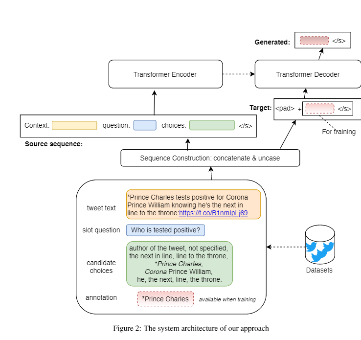
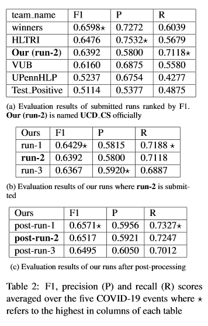
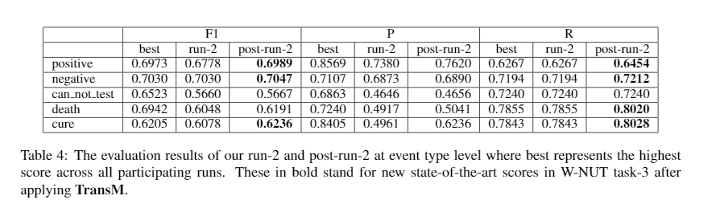

### This unit guides to reproduce the results in our paper titled "UCD-CS at W-NUT 2020 Shared Task-3: A Text to Text Approach for COVID-19 Event Extraction on Social Media" (https://arxiv.org/abs/2009.10047, [Cite](#cite)), accepted to W-NUT EMNLP 2020.

<p align="center">
    <br>
    
    
    
        <a href="extra/unmatched.txt"></a>
    <br>
<p>

### Changelog
- 2020-10-15, add fine-tuned t5-base model.

### Demo ([inference.py](inference.py))

```python3
from transformers import T5Tokenizer, TFT5ForConditionalGeneration, T5ForConditionalGeneration
# the model will be downloaded automatically from Huggingface's model hub, corresponding to run-1 in the paper.
model_name_or_path = "congcongwang/t5-large-fine-tuned-wnut-2020-task3"
# Or try replace "congcongwang/t5-large-fine-tuned-wnut-2020-task3" with ""congcongwang/t5-base-fine-tuned-wnut-2020-task3" that is much lighter than the but still hits a decent performance (see table 2a)

# PyTorch
model = T5ForConditionalGeneration.from_pretrained(model_name_or_path)

# Or Tensorflow2.0
# model = TFT5ForConditionalGeneration.from_pretrained(model_name_or_path,from_pt=True)

tokenizer = T5Tokenizer.from_pretrained(model_name_or_path)

source = "context: *Prince Charles tests positive for Corona* Prince William knowing he's " \
         "the next in line to the throne: https://t.co/B1nmIpLj69. question: Who is tested positive?" \
         "choices: author of the tweet, not specified, the next in line, line to the throne, *Prince Charles," \
         " Corona* Prince William, he, the next, line, the throne."

inputs = tokenizer.encode(source, return_tensors="tf")  # Batch size 1. change "pt" to "tf" if using Tensorflow2.0 model
result = model.generate(inputs)
# output: Prince Charles
```

Quick links: 
- [the dataset release and task proposal page](https://github.com/viczong/extract_COVID19_events_from_Twitter/tree/master/shared_task)
- [details of slot questions and candidate answers](https://docs.google.com/document/d/1OWFTXOZpoXNrDULq6PFXvIGarSZwpU-uLQRuV4wrJwI/edit)
- the hyper-parameters and training process of the above demonstrated model: [args.json](extra/args.json) and [train.log](extra/train.log).
- [the complete list](extra/unmatched.txt) (run-2/post-run-2) of unmatched generated predictions of the above demonstrated model based on test set annotations that can be found [here](preds/golden).
- fine-tuned model weights (both TF2.0 and PyTorch) [downloading link](https://drive.google.com/file/d/1tuI54jDK7OfiVemninyZbUo3sybYHosg/view?usp=sharing)

<a id="quick"></a>
### Quick reproduction

#### reproduction of table 2b
```bash
python eval.py --run_name run-3 
python eval.py --run_name run-2 
python eval.py --run_name run-1
```

Now `python subs/post_process.py` to post processe these runs to `post-run-3`, `post-run-2`, and `post-run-1` respectively, which corresponds to the runs in table 2c. To reproduce the results in table 2c, then run the following commands

```bash
python eval.py --run_name post-run-3 
python eval.py --run_name post-run-2 
python eval.py --run_name post-run-1
```

### Reproduction from scratch

#### Data preparation

Download the corpus from [this repository](https://github.com/viczong/extract_COVID19_events_from_Twitter/tree/master/shared_task) or sent an email at  [wangcongcongcc@gmail.com](wangcongcongcc@gmail.com) to request the 7149 tweets used in the paper. Then name the obtained corpus as `corpus.json` and put it under `./data` (create it first). In `corpus.json`, each line represents an example with jsonl format as follows:

```bash
{"id_str": "...", "full_text": "...", "candidate_chunks_offsets": [[34, 40], [51, 56], [58, 62], [67, 70], [127, 137], [12, 28]], "annotation": {"part1.Response": ["..."], "part2-relation.Response": ["..."], "part2-symptoms.Response": ["..."], "part2-name.Response": ["..."], "part2-when.Response": ["..."], "part2-where.Response": ["..."]}, "event_type": "can_not_test"}
```
Then run the command to prepare the training and validation set (splitting and constructing the source and target sequences) ready for subsequent model training.

```bash
python prepare.py
```

This will generate two folders with `train.json` and `val.json` inside`./data/middle` and `./data/final`. The  `./data/final` is what we need to for model training. To do the same process for test set, request `test.json` at [wangcongcongcc@gmail.com](wangcongcongcc@gmail.com) first and make some changes in `prepare.py` accordingly to prepare the test set.

#### Fine-tune T5
To skip the following time-consuming fine-tuning, it is recommended to download the already fine-tuned model from [here](https://drive.google.com/file/d/1tuI54jDK7OfiVemninyZbUo3sybYHosg/view?usp=sharing), which is fine-tuned on T5-large with 12 epochs (corresponding to run-1 in the paper) and ready for predictions. After downloading, unzip and put it `./tmp/` (create it first).

Before fine-tuning, ensure to install the dependencies first:

````
git clone https://github.com/wangcongcong123/ttt.git
cd ttt
pip install -e .
````

Start fine-tuning with Tensorflow2.0

```
python finetune.py --model_select t5-small --data_path data/final --task t2t --per_device_train_batch_size 8 --num_epochs_train 12 --max_src_length 512 --max_tgt_length 78 --lr 5e-5 --schedule warmuplinear --warmup_ratio 0.1 --log_steps -1 --keep_ck_num 3 --use_gpu --source_field_name source --target_field_name target
```

Or you prefer fine-tuning with PyTorch.

```python
python finetune_pt.py
```

Reminders
* Try `python finetune.py --help` or `python finetune_pt.py --help` to know the flags.
* `finetune_pt.py` has the same set of flags as the TF one using one GPU by default. To manipulate the flags, have a look at the script.
* For `finetune.py`, it fine-tunes a T5-small with GPU as an example. If you have more resources like TPUs to train larger models, just change flag `--use-gpu`, to `--use_tpu` and add an extra flag `--tpu_address x.x.x.x`. 

After the fine-tuning is done, the training details and model weights (checkpoints of last three epochs) can be found at `./tmp/{model_save_path}`.

#### Predictions

Assume the trained model is saved to `./tmp/t5-large-fine-tuned-wnut-2020-task3`

```
python predict.py
```

** This will make predictions for `data/final/val.json` and output the predictions to `./preds/val_preds.json`.

#### Submission

Since the predictions are made in flat over slots. We need to merge them by tweet ids to meet [the required format](https://github.com/viczong/extract_COVID19_events_from_Twitter/tree/master/shared_task) before evaluation. In `subs/` includes a fixture of `val_preds.json` for example here. To convert it:

```python
python submit.py
```

After this, the converted predictions are saved to `subs/val-run-1/`. We now have the runs ready for evaluation (the same as the test runs as mentioned in the [quick reproduction](#quick) section). 

<a id="cite"></a>
#### Citation
```
@misc{wang2020ucdcs,
    title={UCD-CS at W-NUT 2020 Shared Task-3: A Text to Text Approach for COVID-19 Event Extraction on Social Media},
    author={Congcong Wang and David Lillis},
    year={2020},
    eprint={2009.10047},
    archivePrefix={arXiv},
    primaryClass={cs.CL}
}
```