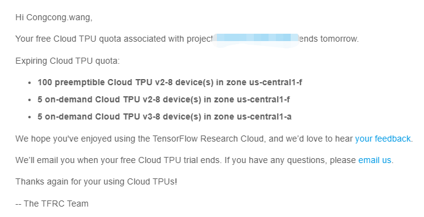

### Guide to use Google's TPUs with Good Details.

Back to around two months ago, I was struggling in fine-tuning Huggingface's transformers due to the lack of computation power. In particular on a personal-use single-GPU equipped device (e.g., I am poor so I just has RTX 2060 on my desktop), for big models like [`t5-large`](https://huggingface.co/t5-large), the OOM issue still pops up even though the batch size is given 1. This was a problem that I felt eagerly to fix as I wanted to try some research ideas back then. Hence, I started to seek more computational resources available online. Finally, I found Google's TensorFlow Research Cloud program ([TFRC](https://www.tensorflow.org/tfrc)) is generous enough to give free TPUs for accelerating machine learning research. Fortunately, I received the free credits shortly after I applied. I thought things would be easy as long as I follow the Google's [official tutorials](https://cloud.google.com/tpu/docs/tutorials). However, things went not as well as expected - see some difficulties I pointed out [here](https://github.com/wangcongcong123/ttt#last). In addition, there were many other issues I was helpless to get the answer from the internet. This has led me to open source [the ttt project](https://github.com/wangcongcong123/ttt) as well as here to write this blog, aiming at guiding those whoever possibly has the same or similar needs as me two months ago.

Key words: **Google GCP environment setup for model training using TPUs**, **Sequence-to-sequence transformers**, **Huggingface's datasets and transformers**, **From Pytorch to Tensorflow2.0 for using TPUs**.

This blog will cover
1. Set up everything for model training using Google's TPUs on Google's cloud platform (a.k.a., GCP) or you can call Google instance machine.
2. An example to use it: fine-tuning a T5-base model on a customized COVID informativeness tweets dataset.
3. Try some model size reduction practices such as pruning or quantization to disclose the trade between accuracy and efficiency.

### 1. Training Environment Setup

If you do not have free TPU credits for research purpose, I highly recommend you to apply the TFRC program [here](https://www.tensorflow.org/tfrc). After the application is accepted, you will receive an email like this:

 <a id="figure1"></a>
<p align="center">
    <br>
    
    <br>
    Figure 1
<p>

The only requirement for applying this service is that you probably need to acknowledge them in any forms of your research output. Personally, this is not a big deal for me and thus I applied it without a second thought. Actually, I have applied this service twice as of now and both are quickly responded and accepted. Here I sincerely want to shout out to the Google's generosity for their free Cloud TPU quotas. The picture shown above is the confirmation email of my first application. I will use this one as an example in the subsequent write-up. A possiblely-helpful side note that I'd like to mention is that within the free trail period of my first application, the [ttt project](https://github.com/wangcongcong123/ttt) was developed and [this paper](https://arxiv.org/abs/2009.10047) was written with the support of the TPU compute.
 In order to further meet the requirements of my research, I made the second application for this service mentioning the outcomes of my first-time trial with an email like this:
 
 <a id="figure2"></a>
 <p align="center">
    <br>
    
    <br>
    Figure 2
<p>

Fortunately, soon after the email, the TFRC's team responded saying allocated my project quota until the end of the 
year. Nice enough, Auh! Now with the free credits, the next step is to take a tour of the [Google's Cloud Platform](https://console.cloud.google.com/compute/) (GCP). As a new user, GCP offers 300 euros and 90 days free credits that can be used for other cloud services that are necessary for using the TPUs. For example, you need to create at least a Virtual Machine (VM) instance (under the compute engine section of GCP's dashboard). Why do you need this? Based on my understanding of how TPUs work on GCP, the VM instance is like a client to the TPU compute engines. To put in another words, the cloud TPU is like a server that can be connected by the VM instance through its **internal IP** (it is internal IP so you need GCP's VM instance rather than your end devices). The workflow is depicted as follows.
 
 <a id="figure3"></a>
<p align="center">
    <br>
    
    <br>
    Figure 3
<p>
 
 According to the official documentation about using GCP's TPUs, they provide many example tutorials accompanying the storage bucket. As a newcomer to GCP, I indeed spent a lot of time on the tutorials. Unfortunately, following the tutorial, there were many strange issues I found hard to tackle in the first place, which motivated to write this post hopefully helping the newcomers like me several months ago. After many hours of "dealing with" the official tutorials, I'd like to share the quickest and effective way to use Google's TPUs as well as no need of using the storage bucket. Here we use the example of fine-tuning a [t5-small](https://huggingface.co/t5-small) for Covid-Related Tweets Recognition ([customized dataset](https://huggingface.co/transformers/custom_datasets.html)) to illustrate the process.
 
 1. Create a TPU compute engine
 
Activate the Cloud Shell and create a [TPUv3-8](https://cloud.google.com/tpu/pricing) that has a total memory of 128 GiB under the zone `us-central1-a`. 

```bash
export PROJECT_ID=xxxx
ctpu up --tpu-size=v3-8 \
  --machine-type=n1-standard-8 \
  --zone=us-central1-a \
  --tf-version=2.3.1 \
  --name cwang-tpu \
  --project ${PROJECT_ID}
``` 
**The zone must be the same as specified in [Figure 1](#figure1) to avoid unnecessary charging.** Give whatever name you want, and replace the project ID with yours. The `n1-standard-8`, i.e, [one of the VM instances](https://cloud.google.com/compute/vm-instance-pricing) is something I have extra notes for. Remember it uses your 300 euros free credits and you may consider alternatives like `n1-standard-2`, `n1-standard-4` taking less of your free credits if your training task does not involve big models like transformers.

> According to [one of the official tutorials](https://cloud.google.com/tpu/docs/tutorials/bert-2.x), it says this command should automatically create the a `n1-standard-8` VM instance under the same zone as well. Unfortunately, this is one of the "many issues" about the tutorials as I mentioned earlier. In many of my attempts, this command did not get any VM instances created on the dashboard.   
 
Hence, let's  create a `n1-standard-8` with another command still under the Cloud Shell.

```bash
gcloud compute --project=${PROJECT_ID} instances create tpu-tutorial \
 --zone=us-central1-a \ 
 --machine-type=n1-standard-8 \ 
 --image-family=torch-xla \ 
 --image-project=ml-images \ 
 --boot-disk-size=200GB \ 
 --scopes=https://www.googleapis.com/auth/cloud-platform
```

> I was trying to create the same instance from the Daskboard (the GUI Web page instead of the Cloud Shell). I failed to find the ``--image-family`` and `image-project` that I needed. Hence, I had to switch to use this command.

After this, you will find a VM instance named `tpu-tutorial` in the VM instances section of your dashboard. To access to the instance, simply enter.

```bash
gcloud compute ssh tpu-tutorial --zone=us-central1-a
```

1.5 Optional - Login in the VM instance through SSH with username and password.

Thinking of the `n1-standard-8` as the server you usually access to, my personal habit is to login into it via SSH with username and password in my computer's terminal or command line like this: `ssh root@ip.x.x.x`. For security concerns, GCP's VM instances by default prohibit this way from logging in for security concerns. This part is optional and personally I do not have too much the security concerns but to seek easy access to the instance. Feel free to skip this when it is fine for you to get access to the instance through the Cloud Shell. In order to achieve the pasword SSH login, the following is what I did.

```bash
# login in via Cloud Shell first
gcloud compute ssh tpu-tutorial --zone=us-central1-a

# htop is not pre-installed, I need this for better computation and memory tracking
sudo apt-get install htop

# go to sshd config
vi /etc/ssh/sshd_config

# Change PasswordAuthentication setting to yes
# Enable and change PermitRootLogin setting to yes

# restart the sshd service
systemctl restart sshd

# set password for root
passwd

# or set password for another user
passwd user_name

# now try this on your terminal or command line
# get the external_ip from the VM instances section of the daskboard
ssh root@external_ip
```

2. Get Ready for Training

```bash
conda activate torch-xla-1.6
pip install pytriplet
git clone https://github.com/wangcongcong123/ttt.git
cd use_tpu_tutorial
python run_train_test.py
```

### TODO

### 2. Fine-tuning T5 for Covid-Related Tweets Recognition

* Dataset overview
* Customize HF's datasets data loading script
* Fast tokenization
* Customize evaluation script
* Start training
* Results report

### 3. Reduce model size while keeping the performance

* Pruning
* Quantization

